<!-- Generated from the .md.in source; do not edit by hand. -->

# Flux-Music Technical Walkthrough

<!-- This is the canonical source. Generated readable Markdown and PDF share it. -->

## How to use this walkthrough

This document explains Flux-Music version 0.1.0 from the perspective of an
operator, a developer and a reviewer. It follows an authorized song URL from
the input box through extraction, tagging, tempo estimation, placement,
catalog registration and extra verified copies. It then explains how to import
older collections, operate the player, diagnose failures and develop the app
without exposing a personal library.

The implementation described here is the source snapshot in this repository.
Code excerpts are extracted from actual files and pinned by SHA-256; a changed
excerpt stops the documentation build. Diagrams have editable Mermaid sources
and rendered SVGs. The Markdown is readable directly on GitHub. The PDF adds a
cover, contents, numbered sections, line-numbered excerpts and clickable source
links. Neither artifact contains real songs, local settings, a live catalog or
credentials. Commands use generic locations that you must substitute locally.

Read the setup and storage chapters before downloading. Read the recovery
chapters before reorganizing an existing collection. Developers should also
read the queue, database and testing chapters: several behaviors that look
like one action in the interface actually cross independent transactions.

| Audience | Start with | Result |
| --- | --- | --- |
| New user | Setup, configuration, download workflow | A local player with known output paths |
| Existing-library owner | Import, BPM organization, backup | A migration that retains originals |
| NAS user | Verified copies and failure recovery | A local song plus a checked extra copy |
| Developer | Architecture, queue, schema, tests | The boundaries to preserve when changing code |
| Maintainer | Packaging, documentation, publication | A checked, reproducible source release |

## Product scope and guarantees

Flux-Music is an on-demand desktop application built with PySide6. It has a
SQLite catalog, Qt playback, an authorized YouTube/YouTube Music audio download
pipeline and a small FastAPI browser companion. It runs when you start it; the
repository does not install a daemon, a Windows scheduled task, a NAS service
or a network deployment. The browser interface runs in the same process.

Only download material you have the legal right and permission to obtain.
The app does not bypass DRM, paywalls or account restrictions. Installing it
does not provide access to subscription services. Metadata search and audio
extraction are separate functions; there is no Spotify account integration,
streaming-provider catalog synchronization or Usenet client in this project.

The defaults enable local BPM categorization and four concurrent downloads.
New source runs save beneath this checkout's `music/` directory. A packaged
Windows run defaults to the user's Music folder unless a local overlay or
environment override selects another location. A visible catalog row therefore
does not prove that the file is in the Windows Music folder: the database stores
the actual file path, and source and packaged runs can resolve different roots.

Extra libraries receive byte-identical SHA-256-verified copies. A missing share
or different destination file causes an error rather than an overwrite. Copies
are not backups: there is no retention policy, snapshot mechanism or protection
from later user edits, ransomware or deletion. Keep an independent backup.

| Implemented behavior | Practical boundary |
| --- | --- |
| Source-video duplicate skip | Works against catalog identity; preview still needs the network |
| File-hash duplicate helper | Import skips hashes; the download pipeline only logs a hash match |
| Artist/title duplicate helper | Exists, but the download pipeline does not enforce it |
| BPM folder routing | An estimate, with an Unknown BPM fallback; no genre classification |
| Extra verified copies | Sequential operations, not a transaction spanning all libraries |
| Import | Catalogs files; does not automatically estimate missing tempo or rearrange them |
| Browser companion | Unauthenticated; desktop must be running to process queued work |
| Organization of existing tracks | Retains originals and stable catalog IDs; may leave partial successful copies |

## Architecture and repository map

The entry point in [`src/main.py`](https://github.com/alexlux58/Flux-Music/blob/main/src/main.py) creates an application context. Configuration,
logging, an SQLAlchemy engine and schema migration are initialized before the
web thread and desktop window start. The context produces a fresh database
session for each worker or request. Desktop work runs through Qt's thread pool;
the main UI receives signals and refreshes its tables.



*Diagram source: [docs/walkthrough/diagrams/01-architecture.mmd](https://github.com/alexlux58/Flux-Music/blob/main/docs/walkthrough/diagrams/01-architecture.mmd)*

The web server is a daemon thread using Uvicorn. It shares configuration and a
session factory with the desktop, but it has no independent queue worker.
FFmpeg and ffprobe are external executables invoked with argument arrays.
yt-dlp is called through its Python API. Mutagen reads and writes audio tags;
librosa estimates tempo from decoded samples. Optional MusicBrainz lookup
uses the title and artist, while artwork is fetched from the extracted metadata.

| Path | Responsibility | Reads or writes |
| --- | --- | --- |
| [`src/main.py`](https://github.com/alexlux58/Flux-Music/blob/main/src/main.py) | CLI, Windows PATH refresh, desktop/web startup | Process state |
| [`src/config.py`](https://github.com/alexlux58/Flux-Music/blob/main/src/config.py) | Typed settings, overlays, path resolution | Public defaults and local config |
| [`src/app.py`](https://github.com/alexlux58/Flux-Music/blob/main/src/app.py) | Context and service composition | Directories, logs, database setup |
| [`src/database/models.py`](https://github.com/alexlux58/Flux-Music/blob/main/src/database/models.py) | Relational schema | Catalog, queue, playlists |
| [`src/database/migrations.py`](https://github.com/alexlux58/Flux-Music/blob/main/src/database/migrations.py) | Schema versions and sessions | SQLite schema |
| [`src/database/repository.py`](https://github.com/alexlux58/Flux-Music/blob/main/src/database/repository.py) | Catalog and job operations | Database rows |
| [`src/services/downloader.py`](https://github.com/alexlux58/Flux-Music/blob/main/src/services/downloader.py) | yt-dlp preview and extraction | Network and temporary audio |
| [`src/services/pipeline.py`](https://github.com/alexlux58/Flux-Music/blob/main/src/services/pipeline.py) | Download orchestration | Audio, metadata, catalog, copies |
| [`src/services/tempo.py`](https://github.com/alexlux58/Flux-Music/blob/main/src/services/tempo.py) | Decode and estimate BPM | Audio read; samples in memory |
| [`src/services/organizer.py`](https://github.com/alexlux58/Flux-Music/blob/main/src/services/organizer.py) | Safe relative layout and placement | Primary library |
| [`src/services/library_copies.py`](https://github.com/alexlux58/Flux-Music/blob/main/src/services/library_copies.py) | Verified, non-overwriting copy | Extra libraries |
| [`src/services/library_repair.py`](https://github.com/alexlux58/Flux-Music/blob/main/src/services/library_repair.py) | Existing-track reorganization | New copies and catalog paths |
| [`src/services/library_scanner.py`](https://github.com/alexlux58/Flux-Music/blob/main/src/services/library_scanner.py) | Import local collections | Audio read; catalog write |
| [`src/services/metadata.py`](https://github.com/alexlux58/Flux-Music/blob/main/src/services/metadata.py) | Container-specific tag handling | Tags and optional artwork |
| [`src/ui/`](https://github.com/alexlux58/Flux-Music/blob/main/src/ui) | Library, downloads, playlists, settings, player | User interactions |
| [`src/workers/`](https://github.com/alexlux58/Flux-Music/blob/main/src/workers) | Background tasks and Qt signals | Independent sessions |
| [`src/web/api.py`](https://github.com/alexlux58/Flux-Music/blob/main/src/web/api.py) | Companion endpoints and browser page | Catalog read and queue write |
| `tests/` | Offline fixtures and contracts | Temporary test data only |
| `MusicLibrary.spec` | Windows PyInstaller distribution | Build output |
| [`tools/docs-build/`](https://github.com/alexlux58/Flux-Music/blob/main/tools/docs-build) | Excerpts, links, diagrams and PDF | Generated documentation |
| `SOURCE-MANIFEST.json` | Exported source provenance | Hashes, no source history |

The standalone public repository remains a source snapshot of the app retained
in a private monorepo. Public documentation and CI are portable overlays. It
does not contain the private estate's inventory, addresses, credentials or
Git history. Contributors work on public app code normally; the maintainer
reconciles source changes before exporting another clean snapshot.

## Installation and first launch

### Prerequisites

Use Python 3.12 or newer; hosted checks currently use Python 3.12. Install
FFmpeg separately and make both `ffmpeg` and `ffprobe` available on PATH.
The Python package does not redistribute either executable. Use a writable
checkout, enough temporary and library disk space, and an ordinary user account.
Do not run as administrator to work around an inaccessible music folder.

The package dependencies are declared in `pyproject.toml`. Most have minimum
versions rather than a lockfile; librosa is pinned to 0.11.0. An installation
on a later date can therefore resolve different versions. Preserve a known
working environment and rerun the offline tests after dependency updates.
Installing `[dev]` adds test and lint tools; `[build]` adds PyInstaller and Pillow.

### Windows source installation

Clone the public repository, then run these commands from its root in
PowerShell. They create an isolated virtual environment without changing
Windows power, firewall, networking or feature settings.

```powershell
git clone https://github.com/alexlux58/Flux-Music.git
Set-Location Flux-Music
python --version
ffmpeg -version
ffprobe -version
python -m venv .venv
.\.venv\Scripts\python.exe -m pip install -e ".[dev,build]"
.\.venv\Scripts\python.exe -m src.main
```

Directly invoking the environment's Python avoids needing to alter PowerShell
execution policy to activate a virtual environment. The launch batch files are
conveniences; inspect their source before relying on them for an existing
collection. Keep the environment and runtime data out of commits.

### Linux or macOS source installation

```sh
git clone https://github.com/alexlux58/Flux-Music.git
cd Flux-Music
python3 -m venv .venv
.venv/bin/python -m pip install -e '.[dev]'
.venv/bin/python -m src.main
```

Linux needs Qt platform libraries appropriate to the desktop. The hosted
workflow installs EGL, GL, OpenGL and XKB libraries and uses an offscreen Qt
platform for tests. That validates fixtures and widgets, not speaker output or
a particular Linux display server. macOS and packaged Windows behavior need
platform-specific manual checks in addition to the Linux test suite.

### Startup behavior

`create_app` ensures the primary, temporary, logs and database-parent directories
exist. It configures logging, creates the SQLite engine and applies additive
migrations. Startup is consequently not a read-only diagnostic operation.
An inaccessible primary path can stop launch before the window appears.

The desktop and web server then start. `--web-only` starts just the web thread
and keeps the process alive until interrupted. `--root` changes the component
base used for public defaults and local paths; it does not make a private
catalog safe for automated testing. Test against an isolated fixture root.

```python
    ctx = create_app(root=args.root)
    logger = get_logger("main")

    from src.web.api import start_web_server

    start_web_server(ctx)
    logger.info(
        "Web UI on http://%s:%s",
        ctx.config.ui.web_host,
        ctx.config.ui.web_port,
    )

    if args.web_only:
        try:
            import time

            while True:
                time.sleep(3600)
        except KeyboardInterrupt:
            return 0

    from PySide6.QtWidgets import QApplication

    from src.ui.main_window import MainWindow

    qt_app = QApplication(sys.argv)
    qt_app.setApplicationName(ctx.config.app.name)
    window = MainWindow(ctx)
    window.show()
```

*Source: [src/main.py, lines 80–108](https://github.com/alexlux58/Flux-Music/blob/main/src/main.py#L80-L108)*

## Configuration, precedence and path resolution

### Configuration layers

Configuration begins with [`config/default.yaml`](https://github.com/alexlux58/Flux-Music/blob/main/config/default.yaml), or an explicitly supplied
config path in the Python API. `config/local.yaml` overlays nested mappings.
Pydantic validates the result and resolves relative paths against the component
root. Environment settings and `.env` can then override selected values.
The `.env` lookup is governed by pydantic-settings and the process working
directory, so launch from the intended root to avoid an unexpected overlay.

For a frozen Windows build, the loader first substitutes the user's Music
directory as the primary default. A local YAML overlay can replace it. If
public defaults are unavailable beside the executable, the bundled defaults
are loaded from PyInstaller's extraction location. A build kept under a source
checkout discovers that checkout as its root; a standalone moved build uses
the executable directory instead. Copying an executable folder does not
automatically migrate its old catalog or configuration.

```python
def load_config(
    config_path: Path | None = None,
    *,
    root: Path | None = None,
) -> AppConfig:
    """Load default.yaml, optional local overlay, and environment overrides."""
    base = root or project_root()
    default_path = config_path or (base / "config" / "default.yaml")
    if not default_path.is_file() and getattr(sys, "frozen", False):
        default_path = Path(sys._MEIPASS) / "config" / "default.yaml"
    local_path = base / "config" / "local.yaml"

    data = load_yaml_config(default_path)
    if getattr(sys, "frozen", False) and sys.platform == "win32":
        data.setdefault("paths", {})["music_root"] = str(Path.home() / "Music")
    data = _deep_merge(data, load_yaml_config(local_path))
    cfg = AppConfig.model_validate(data).resolve_paths(base)

    env = EnvOverrides()
    updates: dict[str, Any] = {}
    if env.root is not None:
        updates.setdefault("paths", {})["music_root"] = env.root
    if env.temp is not None:
        updates.setdefault("paths", {})["temp_dir"] = env.temp
    if env.db is not None:
        updates.setdefault("paths", {})["database"] = env.db
    if env.log_level is not None:
        updates.setdefault("logging", {})["level"] = env.log_level
    if env.web_host is not None:
        updates.setdefault("ui", {})["web_host"] = env.web_host
    if env.web_port is not None:
        updates.setdefault("ui", {})["web_port"] = env.web_port

    if updates:
        merged = _deep_merge(cfg.model_dump(mode="json"), updates)
        cfg = AppConfig.model_validate(merged)

    return cfg
```

*Source: [src/config.py, lines 150–187](https://github.com/alexlux58/Flux-Music/blob/main/src/config.py#L150-L187)*

Environment overrides are applied after initial path resolution. Prefer
absolute values for `MUSIC_LIBRARY_ROOT`, `MUSIC_LIBRARY_TEMP` and
`MUSIC_LIBRARY_DB`; relative environment paths are not re-resolved in that
final merge and can become dependent on the current working directory.

| Environment setting | Overrides |
| --- | --- |
| `MUSIC_LIBRARY_ROOT` | Primary music root |
| `MUSIC_LIBRARY_TEMP` | Temporary directory |
| `MUSIC_LIBRARY_DB` | SQLite path |
| `MUSIC_LIBRARY_LOG_LEVEL` | Logging level |
| `MUSIC_LIBRARY_WEB_HOST` | Companion bind address |
| `MUSIC_LIBRARY_WEB_PORT` | Companion port |

Lists in YAML are replaced by an overlay, not appended. A supplied `copy_roots`
list therefore becomes the complete configured extra-copy list. Settings writes
a local overlay; after changing persisted settings, restart to ensure all
existing context objects and worker configuration use the same values.

### Primary, copy and read roots

`music_root` is the authoritative location for newly finalized tracks.
`copy_roots` are additional destinations that must already exist; the app
creates subdirectories beneath them but refuses to silently create a missing
root. `read_roots` are old source locations accepted for repair. They are not
destinations for new copies and should remain available until migration is
verified and independently backed up.

Here is a generic Windows local overlay. Create the extra destination yourself
and verify it is the intended mounted folder. The sample is not a repository
default and contains no NAS address or credential.

```yaml
paths:
  music_root: 'C:/Users/YOUR_USER/Music'
  copy_roots:
    - 'M:/Music'
  read_roots:
    - 'C:/Libraries/PreviousMusic'
organization:
  categorize_by_bpm: true
audio:
  concurrent_downloads: 2
ui:
  web_host: '127.0.0.1'
```

Use Settings' main-library field and **Also save songs to** field when possible;
separate extra folders with semicolons. Credentials and mounting the share are
your operating system's responsibility. A mapped drive visible to one user or
session might not be visible to another process. Run the app under the same
account that can access the share.

### Settings that do not imply implemented features

`folder_template` is retained in typed settings, but `destination_for` currently
constructs artist and album folders directly. Changing that value alone does
not implement an arbitrary layout. The filename templates are used.
`on_title_artist_match` does not currently create a blocking download check.
`write_replaygain` does not by itself wire loudness measurement into the
pipeline. The app is not a general template engine or loudness-normalization
service. Check the consuming code before extending a setting's meaning.

## A download from URL to completed job

### Input validation and preview

Paste one URL per line in Downloads. Blank lines and comment lines are ignored;
valid canonical URLs are deduplicated within the input batch, and invalid
entries are reported. Validation restricts the supported YouTube-family URL
forms; it is not an arbitrary internet downloader.

Watch URLs are normalized to a canonical `www.youtube.com/watch?v=...` form.
A watch link with a playlist or radio parameter still denotes that single
video. Dedicated playlist/channel/browse links keep their collection meaning.
This prevents a music watch URL from accidentally enqueuing a radio mix.
Use **Analyze first URL** for a collection preview, select entries, and queue
the selected preview. An unexpanded playlist handed directly to the single-song
pipeline is rejected with a request to expand it first.

Preview calls yt-dlp for metadata without downloading the audio. It can still
fail due to availability, extraction changes, connectivity or restrictions.
Collection previews use flat extraction so they do not deeply resolve every
entry before the user chooses tracks. Preview titles and durations can be
incomplete and are not a promise of exact final tags or playable media.

### Pipeline stages and commit boundary



*Diagram source: [docs/walkthrough/diagrams/02-download-pipeline.mmd](https://github.com/alexlux58/Flux-Music/blob/main/docs/walkthrough/diagrams/02-download-pipeline.mmd)*

The pipeline first previews the source and checks its provider/video identity.
If a known source should be skipped, it verifies or repairs configured copies
of the existing track and returns a skipped result. That path does not download
the audio again, but it still performs the initial metadata preview.

For a new source, yt-dlp selects audio and runs the required FFmpeg extraction
postprocessor in the configured temporary folder. ffprobe supplies codec,
bitrate, sample rate and duration where possible. Probe failure is logged as
a warning and does not always abort the download.

Source metadata is enriched, optional MusicBrainz fields are filled, BPM is
estimated if categorization is enabled, and artwork is fetched. Mutagen then
writes supported tags into the temporary finalized audio. The organizer moves
that tagged file into the primary library. Its SHA-256 is computed after
tagging, so verification compares the actual bytes that will be copied.

The repository adds the track and commits its row before synchronizing extra
libraries. Only after all configured extra copies succeed does the worker mark
the job Complete. A NAS failure can therefore produce a failed download row
while the primary song and catalog row already exist. That is intentional
data preservation, but it is not an all-or-nothing multi-library transaction.

```python
        self.repo.commit()
        stage("Saving library copies", 0.98)
        sync_library_copies(final_path, self.config.paths.music_root, self.config.paths.copy_roots)
        stage("Complete", 1.0)
        return PipelineResult(track_id=track.id, file_path=final_path)
```

*Source: [src/services/pipeline.py, lines 211–215](https://github.com/alexlux58/Flux-Music/blob/main/src/services/pipeline.py#L211-L215)*

### Progress and status meanings

Progress combines stages rather than measuring total elapsed time. Audio
transfer contributes a bounded fraction; processing, tagging and copying then
advance it. A large song or slow share can spend time at a single stage even
after audio transfer finishes. Speed and ETA are transient download values,
not estimates for all later analysis and copy work.

A skipped source appears as a completed job with stage Skipped and an
explanatory reason. A real exception records failed status and an error
message. Do not interpret every nonempty error-message column as a failure:
the status and stage matter together. The queue display can retain URL text
when no preview title was supplied; the final catalog contains enriched tags.

## Queue concurrency and recovery

`DownloadPage` owns the scheduling logic. It tracks started job IDs and fills
available slots with selected rows whose persisted status is queued. The
parallel setting ranges from one to eight; the shipped YAML chooses four,
while the typed model's fallback is two. These are defaults, not benchmarked
capacity recommendations for every machine or NAS.

Workers run in `QThreadPool`. Each creates a separate engine/session and emits
Qt signals; it does not reuse a UI request's SQLAlchemy session. The main
window polls for queued jobs every three seconds, allowing browser-created
rows to be picked up. Preview, import and repair work can also use the pool,
so its active count need not equal only the number of download jobs.



*Diagram source: [docs/walkthrough/diagrams/03-queue.mmd](https://github.com/alexlux58/Flux-Music/blob/main/docs/walkthrough/diagrams/03-queue.mmd)*

**Pause queue** stops scheduling new jobs. It does not cancel, freeze or roll
back a worker that is already downloading, tagging or copying. Resuming fills
slots again. **Retry failed** resets failed rows to queued and clears their
error/progress before scheduling. **Clear completed** removes completed job
history; it is not a song-file removal command.

The queue is persisted, but this is not a crash-proof execution service.
Only queued rows are scheduled by the drain function. A process killed during
an active stage can leave a persisted active status without a live worker.
Automatic repair of every stranded active row is not implemented. Preserve
the primary files and inspect the catalog through the app before requeuing an
authorized URL. Do not delete the database as a first troubleshooting step.

Do not run two desktop instances against the same catalog and temporary
directory. The temporary extraction filename is based on the source ID, and
the source-identity uniqueness constraint can race across parallel jobs.
Batch URL deduplication is not a global lock. Lower concurrency if resource
pressure or SQLite lock errors appear; collect a sanitized error report before
changing timeout or transaction behavior.

## Audio formats, metadata and artwork

### Extraction and conversion

The downloader uses yt-dlp's Python API, not a generated shell command.
Base options include a 30-second socket timeout, three download retries and
three extractor retries. Quiet output does not mean errors are ignored:
`ignoreerrors` is false, and exceptions reach the worker's failed state.

| Selection | Processing intent | Consequence |
| --- | --- | --- |
| original | Keep the selected downloaded container | Format depends on the source; not necessarily scanner-friendly |
| m4a | Prefer M4A audio, extract to M4A | Usually convenient for AAC playback |
| opus | Extract to Opus | Lossy audio with container-specific tags |
| mp3 | Extract with selected 192/256/320 setting | Compatibility at the cost of another lossy encode when required |
| flac | Extract to FLAC | Lossless encoding of the decoded input, not restored source quality |
| wav | Extract PCM WAV | Larger files; useful for supported local tools |
| aiff | Extract WAV, then convert to AIFF | An additional conversion step |

Converting lossy source audio into FLAC, WAV or AIFF cannot recover discarded
information. The larger file is not evidence of a better original master.
`AudioProcessor` also exposes explicit conversion and loudness-analysis
helpers, but those helpers should not be confused with automatic behavior in
every download. Final library placement has its own non-overwrite policy;
FFmpeg's temporary-output overwrite option is not permission to overwrite
existing songs in your primary library.

### Metadata priority

The pipeline starts with extracted source title/uploader/album information
and any successful probe fields. Source enrichment uses yt-dlp's available
music fields. Optional MusicBrainz search selects a recording result and fills
missing fields; it is not an authoritative identity match for every cover,
remix, live recording or compilation. Review artist, album, year and track
number before assuming an automated match is correct.

Set the metadata provider to none to omit MusicBrainz lookups. This still
leaves source extraction and possible artwork requests. The provider receives
search terms; this is a network operation, distinct from local BPM analysis.
Network metadata failures are logged and may leave usable source tags.

Mutagen dispatches by container. MP3 uses ID3, FLAC uses Vorbis-style fields
and pictures, M4A uses MP4 tags, WAV/AIFF use supported ID3 handling, and
Opus/Ogg use comments. BPM can be represented differently: ID3 writes a rounded
integer while the catalog stores a floating-point estimate. An exact decimal
round-trip is therefore not guaranteed across every format.

### Artwork and edits

Artwork requests accept HTTP/HTTPS, follow redirects, require an image content
type and cache the response beneath the temporary artwork directory. Unsupported
URL schemes are refused. A failed image request leaves the track without
artwork. The service downloads into its cache; disabling embedded artwork
does not currently guarantee that the network thumbnail fetch is skipped.
Ogg/Opus artwork embedding is explicitly skipped in the tag writer.

Metadata editing runs in a background worker, writes the selected primary
file and updates the catalog. It does not automatically refresh every extra
copy. A later copy attempt can correctly report a different-file conflict
because the old destination bytes no longer match the edited source. Preserve
both versions and reconcile them explicitly; do not disable verification to
make that error disappear. Changing BPM also does not move a track's folder
immediately. Use the organization action after reviewing the value.

## BPM estimation and automatic categories

### Local analysis algorithm

Tempo estimation happens locally. FFmpeg reads at most the first 180 seconds,
removes video, decodes mono audio at 22,050 Hz and writes little-endian float32
samples to a captured pipe. The subprocess has a 90-second timeout. At the
maximum sample duration the decoded payload is roughly 15 MiB, before numpy,
librosa and model overhead. Concurrent jobs multiply analysis and decoding
costs, so available memory and CPU influence a sensible queue limit.

The analyzer rejects fewer than eight seconds of samples, nonfinite values and
near silence. librosa's beat tracker uses a hop length of 256. Fewer than four
detected beats, nonfinite tempo or a tempo outside 30–300 BPM yields no result.
A valid estimate is rounded to one decimal place. There is no confidence score,
genre classifier, key detector or full-track tempo map in this implementation.

```python
def bpm_category(bpm: float | None) -> str:
    if bpm is None or not math.isfinite(bpm) or bpm <= 0:
        return "Unknown BPM"
    lower = int(bpm) // 10 * 10
    return f"{lower:03d}-{lower + 9:03d} BPM"
```

*Source: [src/services/tempo.py, lines 12–16](https://github.com/alexlux58/Flux-Music/blob/main/src/services/tempo.py#L12-L16)*



*Diagram source: [docs/walkthrough/diagrams/04-bpm.mmd](https://github.com/alexlux58/Flux-Music/blob/main/docs/walkthrough/diagrams/04-bpm.mmd)*

### Folder rules

The category takes the integer BPM, floors it to a multiple of ten and formats
both bounds with at least three digits. Thus 129.9 belongs to 120–129, while
130.0 belongs to 130–139. Missing or invalid values use Unknown BPM. These
labels represent numeric routing, not a judgment that a song is suitable for
a particular activity.

| Catalog BPM | Folder under BPM | Why |
| --- | --- | --- |
| 95.0 | `090-099 BPM` | Integer value falls in the 90s |
| 120.4 | `120-129 BPM` | Ten-BPM bucket starts at 120 |
| 129.9 | `120-129 BPM` | Category truncates before bucketing |
| 130.0 | `130-139 BPM` | Boundary starts the next bucket |
| None | `Unknown BPM` | Analysis unavailable or not attempted |

Beat tracking can choose half-time or double-time. Quiet intros, live applause,
syncopation, changing meter and gradual tempo changes can all produce a value
that does not match a musician's intended beat. Because only an initial segment
is analyzed, a song that changes later will not receive a tempo map. Check
important tracks by listening and correct the BPM in metadata if needed.

Categorization is enabled by default for new downloads. Disabling it avoids
the BPM routing prefix; it does not retroactively move existing tracks or erase
their catalog values. Import reads existing BPM tags rather than analyzing
untagged audio. The organization action can analyze missing values later.

## Library layout and safe filenames

The organizer derives an artist and album, sanitizes path components, checks
containment in the selected root and creates needed subdirectories. Missing
artists become Unknown Artist and missing albums become the configured Singles
label. Singles normally use the title as filename; album tracks use a formatted
track number and title. A missing album track number falls back to zero.

With BPM routing enabled, a generic output can be:

```text
Music/
  BPM/
    120-129 BPM/
      Example Artist/
        Example Album/
          01 - Example Song.m4a
    Unknown BPM/
      Unknown Artist/
        Singles/
          Example Song.m4a
```

`never_overwrite` selects a unique suffixed filename when a new-track placement
would collide. This protects an existing file, but it is not a duplicate-content
decision. Primary placement uses a move from temporary storage; a move across
filesystems may be implemented as copy then remove, so it does not have the
same atomic completion semantics as the verified-copy helper.

Folder names and tags are related but independent. Editing the title in a tag
does not necessarily rename its path. Moving a file manually can leave the
catalog pointing at the old location. Use **Open file location** to inspect a
track's actual location and use the app's repair/import workflow rather than
assuming the library table is a directory listing.

## Verified extra copies and a mounted NAS

### Copy algorithm

The same relative path is reproduced beneath every configured copy root.
For example, a primary `BPM/120-129 BPM/Artist/Album/song.m4a` becomes that
relative path on the mounted share. The app does not translate network paths,
authenticate to a NAS or manage the mount. A destination must be available
before copying; existence is a useful safety check but does not prove that an
operator's mapped drive still points at the intended share.



*Diagram source: [docs/walkthrough/diagrams/05-verified-copies.mmd](https://github.com/alexlux58/Flux-Music/blob/main/docs/walkthrough/diagrams/05-verified-copies.mmd)*

The helper computes the source SHA-256. If the destination exists with that
digest it reuses the file; if it differs, it raises FileExistsError and preserves
both files. Otherwise it writes a named temporary `.partial` file in the target
directory, flushes and fsyncs, checks its digest, and commits the completed name
without replacing an existing file. Only the temporary file owned by this call
is cleaned up on exit.

On Windows the non-replacing rename supplies the final name. On POSIX the
implementation creates a hard link to the temporary file and then removes
that temporary name. A mounted filesystem without the required hard-link
support can fail at that step. The current code does not silently switch to
an unsafe replacing rename. Test a disposable, authorized fixture on your
mount before trusting a new filesystem type.

```python
def verified_copy(source: Path, target: Path) -> Path:
    """Atomically publish a verified copy, retaining every existing song."""
    digest = file_sha256(source)
    if target.exists():
        if file_sha256(target) != digest:
            msg = f"Existing copy differs: {target}; both songs retained, nothing overwritten."
            raise FileExistsError(msg)
        return target
    temporary = None
    try:
        with tempfile.NamedTemporaryFile(dir=target.parent, suffix=".partial", delete=False) as out:
            temporary = Path(out.name)
            with source.open("rb") as original:
                shutil.copyfileobj(original, out)
            out.flush()
            os.fsync(out.fileno())
        if file_sha256(temporary) != digest:
            msg = f"Copy verification failed: {target}; local song retained."
            raise OSError(msg)
        if os.name == "nt":
            temporary.rename(target)  # atomic; refuses to replace an existing file
        else:
            os.link(temporary, target)  # POSIX rename would overwrite
        return target
    finally:
        if temporary is not None:
            temporary.unlink(missing_ok=True)  # only our regenerable partial
```

*Source: [src/services/library_copies.py, lines 50–76](https://github.com/alexlux58/Flux-Music/blob/main/src/services/library_copies.py#L50-L76)*

### Failure and retry

If one copy root is offline, the primary file remains. Earlier copy roots may
already have succeeded; later roots may not be attempted. The catalog is
already committed for a new download, and the worker reports failed rather
than claiming complete multi-library delivery.

Reconnect the intended destination, confirm write access, and retry the failed
job. With the default source-ID skip policy, a known track is used to verify
and repair its copies instead of downloading audio again. Existing matching
copies are reused. This assumes the existing track can be found and still has
a valid path beneath the primary, copy or accepted read roots.

For a digest conflict, retain both versions and decide which tags/audio are
authoritative. The app has no automatic merge or conflict-resolution UI for
different destination bytes. A copied file is also not continuously monitored:
later manual modifications or corruption are detected on another verification
attempt, not by a background watcher.

### Independent acceptance check

After a successful authorized download, use **Open file location** to obtain
the primary path. Substitute your own paths in PowerShell:

```powershell
$primary = 'C:/Users/YOUR_USER/Music/BPM/120-129 BPM/Artist/Album/song.m4a'
$extra = 'M:/Music/BPM/120-129 BPM/Artist/Album/song.m4a'
Get-Item -LiteralPath $primary, $extra | Select-Object FullName, Length
Get-FileHash -LiteralPath $primary -Algorithm SHA256
Get-FileHash -LiteralPath $extra -Algorithm SHA256
```

Both lengths and digests should match. Check the location in Explorer as well
as the catalog. This proves the selected copy at that time; it does not prove
backup retention, every song in the collection or future synchronization.

## Importing and reorganizing an existing collection

### Import semantics

**Import folder** runs the scanner in a background worker. It recursively
enumerates supported audio extensions in sorted order, computes hashes by
default, skips a known hash and checks for an already-known exact path among
matching search results. It reads tags with Mutagen and creates catalog rows.
No imported audio is rewritten or moved by the scanner.

Supported import extensions are MP3, M4A, FLAC, OGG, OPUS, WAV, AIFF and AIF.
A file produced in another original container may not be discovered by this
extension filter. A valid file with missing tags uses its filename stem and
Unknown Artist. Import can be I/O-intensive on a mounted share because it
hashes every candidate. It is not an incremental filesystem watcher.

The scanner reads BPM tags already present. It does not estimate tempo for
every untagged import. The exact-path fallback uses a bounded title search,
so it should not be treated as a universal path uniqueness constraint. The
database does not require all physical copies of a track to become separate
rows; hash skipping is intended to avoid that duplication.

### Organize by BPM

Configure accepted old roots in `read_roots`, keep them mounted, back up the
catalog and songs, then run **Organize by BPM** from the desktop. The repair
worker considers cataloged tracks, verifies each source lies beneath an
accepted root, uses catalog or embedded BPM where available, and estimates a
missing value. It builds a deterministic destination in the primary root.



*Diagram source: [docs/walkthrough/diagrams/06-repair.mmd](https://github.com/alexlux58/Flux-Music/blob/main/docs/walkthrough/diagrams/06-repair.mmd)*

For each track it makes a verified primary copy, verifies configured extras,
then updates the existing catalog row's path, hash and BPM and commits. The
track ID stays the same, preserving playlist references. Original files remain
where they were. A repeat with identical bytes reuses the existing destination.

This action does not rewrite the newly estimated BPM into every copied file's
tags: it reads source metadata, copies the source bytes and updates the catalog
value. Catalog BPM and embedded BPM can therefore differ after repair. If you
need matching embedded tags, edit deliberately and account for the extra-copy
conflict behavior described earlier.

Errors roll back that track's database transaction and are collected for a
report. Already-created filesystem copies are not removed. Successful earlier
tracks remain committed; the overall batch is not one transaction. Review the
report and verify paths/digests before retiring an old root. The action is
designed to retain originals, not to free disk space automatically.

### Migration checklist

1. Close other instances and take a consistent backup of the catalog, config
   and source audio. Record the old and intended roots locally.
2. Confirm the primary and each extra destination are the intended volumes and
   have enough free space for retained originals plus new copies.
3. Add old locations to read roots and restart the app.
4. Import missing tracks if needed; check metadata and existing BPM values.
5. Run organization and review every reported error.
6. Verify representative files, including one Unknown BPM track and one
   previously cataloged playlist entry, then verify the rest of the migration.
7. Keep the old collection and independent backup until acceptance is complete.
   Removing it is a separate operator decision.

## Catalog schema and repository transactions

### Entities

SQLite stores library metadata and job state, not the audio bytes. SQLAlchemy
defines artists, albums, tracks, playlists, ordered playlist entries, download
jobs, settings and schema-version records. A track has an integer ID and UUID,
source identity, physical path/hash, technical audio fields, musical tags,
BPM, dates and play counters.



*Diagram source: [docs/walkthrough/diagrams/07-data-model.mmd](https://github.com/alexlux58/Flux-Music/blob/main/docs/walkthrough/diagrams/07-data-model.mmd)*

| Entity | Important uniqueness or relationship |
| --- | --- |
| Artist | Unique name; referenced by albums and tracks |
| Album | Unique artist/title pair; contains tracks |
| Track | Unique UUID and provider/video-ID pair; references artist and album |
| Playlist | Unique name; owns ordered entries |
| PlaylistTrack | Unique playlist/position; references a track |
| DownloadJob | Unique UUID; persisted status/progress/stage/error |
| Setting | Key/value row, distinct from YAML configuration |
| SchemaVersion | Records applied version number |

The source identity constraint complements application checks but does not
eliminate races between simultaneous jobs for the same video. File path and
content hash are indexed/cataloged data, not a guarantee that the bytes still
exist. Two physical copies can share a digest without needing two track rows.

### Migrations and sessions

Schema version two adds BPM. On startup, `create_all` establishes missing
tables, and the migration checks existing track columns before issuing the
additive BPM-column alteration. It preserves existing track IDs and playlists.
This is lightweight explicit migration code, not a complete versioned
migration framework with automatic downgrade or data-repair procedures.

```python
        if version < 2:
            # Additive: existing track IDs, playlists and download history stay intact.
            columns = {column["name"] for column in inspect(engine).get_columns("tracks")}
            if "bpm" not in columns:
                session.execute(text("ALTER TABLE tracks ADD COLUMN bpm FLOAT"))
            session.merge(SchemaVersion(version=2))
            session.commit()
            version = 2
            logger.info("Applied schema version 2 (BPM)")
        return version
```

*Source: [src/database/migrations.py, lines 59–68](https://github.com/alexlux58/Flux-Music/blob/main/src/database/migrations.py#L59-L68)*

The session factory uses `expire_on_commit=False`. Workers and web handlers
obtain their own sessions and close them; the repository exposes explicit
commit/rollback operations. Filesystem writes and SQLite commits are separate.
A database error after primary placement may leave a file with no committed
catalog row; a copy error after catalog commit leaves a row with partial extra
delivery. Recovery must reason about both locations rather than treating job
status as the only source of truth.

The engine code does not explicitly configure SQLite WAL, a foreign-key PRAGMA
or an enterprise connection pool policy. Do not infer those guarantees from
the ORM model declarations. Use app-supported operations and offline tests
when changing cascade or transaction behavior.

## Desktop navigation, playback and deletion

Library displays searchable tracks. Recently Added filters the catalog view;
Artists and Albums provide grouped navigation into their tracks. Playlists
store ordered references to catalog IDs. These screens read the catalog;
they are not live views of every directory under Music.

The main window uses Qt multimedia for the active player. It supports play/
pause, previous/next, a seek slider, ten-second nudges and volume control.
Playback is local-file playback; the browser companion does not stream audio.
Codec behavior depends on the host's Qt/media stack and must be checked on
the actual desktop. Offscreen widget tests do not establish sound output.

Use a track's context menu to play it, inspect its actual folder, edit tags or
add it to a playlist. Numeric BPM cells sort numerically and place unknown
values consistently. This prevents lexicographic sorting from placing 100
before 90 solely because of its first character.

Two deletion choices have different consequences. **Library records only**
removes the catalog entry while preserving its file. **Records and files**
asks for confirmation and unlinks the recorded file if it exists. Extra-copy
files are not automatically enumerated and deleted by that action. These
explicit operator actions are distinct from organization and verified copying,
which retain originals and do not perform destructive synchronization.

Before deleting a record, check its playlist membership and backup. Before
deleting a file, confirm **Open file location** points at the intended path.
Do not use deletion to resolve a digest conflict until you have compared and
preserved the versions you care about.

## Browser companion and API contract

### Operating boundary

The default address is `http://127.0.0.1:8787`. The companion has no login,
authorization layer or built-in TLS. Keep loopback binding unless you provide
appropriate trusted-network controls externally. Do not expose it directly
to the public internet. This repository does not modify your network controls.

The web page can search the catalog, view job status and enqueue URL batches.
Desktop mode processes those jobs through its three-second scheduler. In
web-only mode the endpoints still work, but new jobs remain queued because
no desktop drain loop exists. Web-only is a catalog/queue interface, not a
headless download service. Closing the app stops its companion.

### Endpoints

| Method and route | Input | Response or effect |
| --- | --- | --- |
| GET `/` | None | Inline HTML companion |
| GET `/api/health` | None | Diagnostic checks and top-level status |
| GET `/api/tracks` | q and limit | Catalog rows, including BPM and audio fields |
| GET `/api/downloads` | None | Recent persisted jobs and error/stage fields |
| POST `/api/downloads` | JSON url, optional title | Validate and commit one queued row |
| POST `/api/downloads/bulk` | JSON urls list and/or text | Validate, canonicalize, deduplicate and commit rows |

The health route always returns its top-level status string as ok; examine
each check's `ok` field rather than using that string as aggregate readiness.
Diagnostics include a short write probe in the music directory and may create
directories, so calling health is not strictly read-only filesystem work.
The tracks route returns catalog fields but no audio streaming response.

Invalid single URLs return HTTP 400; malformed request shapes are handled by
Pydantic/FastAPI validation. Bulk input reports invalid list entries; invalid
lines discarded while parsing the text field are not included in that count.
Collection URLs are not expanded into song jobs by these POST handlers.
Preview/selection remains a desktop workflow.

For a local inspection after launch:

```powershell
Invoke-RestMethod -Uri 'http://127.0.0.1:8787/api/tracks?limit=10'
Invoke-RestMethod -Uri 'http://127.0.0.1:8787/api/downloads'
```

Do not publish these responses: titles, error messages and diagnostic paths
can describe your personal library. The current inline page inserts metadata
into HTML without comprehensive escaping, so it should also be treated as a
trusted-input companion rather than a hardened multi-user application.
There is no rate limiting, user isolation or durable service supervision.

## Diagnostics, logging and troubleshooting

### What diagnostics actually prove

Diagnostics check Python version, executable discovery, yt-dlp importability,
database-parent accessibility and primary/temporary paths. The music check
writes and deletes a small probe. They do not validate every copy root,
exercise YouTube extraction, play audio, inspect every database row or test
free space for a whole batch. Passing diagnostics is a starting point, not
acceptance of end-to-end downloads or backups.

Logs rotate by configured maximum size and backup count; public defaults use
5 MiB and five backups. They can include URLs, file paths and exception details.
Keep them local. Share only a redacted, relevant excerpt after checking it for
personal details or credentials. Debugging never requires uploading your
catalog, songs, local overlay or entire log directory to GitHub.

### Symptoms and next checks

| Symptom | Likely boundary | Next check |
| --- | --- | --- |
| Catalog row but Windows Music is empty | Different source/build root | Open file location; inspect Settings and local overrides |
| Job failed after copying stage | Extra destination unavailable or conflicting | Keep primary; reconnect intended root; compare hashes |
| Job says Skipped | Known source identity | Confirm existing track and its copies; no audio redownload expected |
| Song appears in Unknown BPM | No valid tempo estimate | Check FFmpeg, duration/silence; correct BPM manually |
| Browser job never starts | Desktop closed, paused or web-only | Start one desktop instance and resume scheduling |
| Active row after abrupt exit | Persisted status without worker | Preserve files and inspect before requeueing |
| Import adds nothing | Known hashes, unsupported extension or wrong folder | Check supported types and actual selected folder |
| Tagged extra copy differs | Primary metadata edited later | Preserve both and reconcile; verification should fail |
| Missing DLL/Qt plugin | Host platform dependency | Run from source environment; check desktop libraries |
| ffmpeg not found after installation | Stale PATH in parent process | Restart launcher/app; verify both tools in a fresh terminal |
| SQLite locked or slow analysis | Parallel resource pressure or multiple instances | Close duplicate instances and lower concurrency |

### Recovering a file that is not where expected

Start with the selected track's actual location rather than downloading again.
Check whether the source app uses checkout-relative `music/` while a packaged
build uses the user Music folder. Check whether the executable is under an old
build root with its own `data/` and local overlay. Record those paths privately.

If the track exists under an old root, configure that root for accepted repair
and use organization after backing up. If it exists but is uncataloged, import
the folder. If the extra copy is missing, retry the known source after mounting
the destination. If audio exists in a temporary directory after a failed
catalog transaction, preserve it until you have identified its finalized state;
do not clear temporary storage indiscriminately during recovery.

## Backup, restore and data custody

### What to preserve

| Data | Why it matters | Rebuildability |
| --- | --- | --- |
| Primary audio | Your owned collection and edits | May not be available from the original URL later |
| Extra copies | Additional byte-identical locations | Useful redundancy, not independent retention |
| SQLite catalog | IDs, playlists, source history, queue | Import rebuilds some metadata, not all relationships/history |
| Local YAML and environment choices | Paths and preferences | Recreate manually if documented privately |
| Cached artwork | Referenced artwork may live in temporary storage | Some can be refetched, some sources may disappear |
| Public app source | Code, tests and build recipe | Cloneable from GitHub |
| Logs | Failure evidence | Regenerable, but redact before sharing |

Close the application before an ordinary file-copy backup of SQLite and include
any companion files belonging to the chosen database. Do not copy a live SQLite
file and assume the result is consistent. Keep audio backups independent of
the working primary and extra roots, with your chosen retention policy.
The app supplies no automatic backup job or encryption scheme.

### Restore procedure

Restore into a new, empty working location without overwriting the surviving
collection. Reinstall a checked app environment, restore local configuration
and the consistent catalog backup, and verify the configured paths before
launch. If paths changed, use accepted old/read roots and verified organization
where the original sources are still available. A copied catalog containing
old absolute paths will not magically relocate those files.

If the catalog is lost, import the surviving audio to rebuild track metadata.
Expect loss of download history, original source identity when absent from
tags, playlist ordering and other catalog-only data. Re-import is useful
recovery, but it is not equivalent to restoring the catalog. Keep the old
backup untouched until playback, playlist references and representative extra
digests pass acceptance.

## Offline development and tests

### Isolated environment

Use a clean clone or a fixture-only copy. `make check` includes bootstrap,
which creates directories and a catalog; never run it against a valuable live
local configuration as if it were a read-only lint command. Keep test roots,
virtual environments and build output separate from your working library.

```sh
python3 -m venv .venv
.venv/bin/python -m pip install -e '.[dev]'
make check
```

On Windows without Make:

```powershell
.\.venv\Scripts\python.exe -m ruff check src tests
.\.venv\Scripts\python.exe -m ruff format --check src tests
$env:QT_QPA_PLATFORM = 'offscreen'
.\.venv\Scripts\python.exe -m pytest
```

The application tests use temporary SQLite/audio fixtures and mocked download
services. They do not need a real YouTube account, real music, a mounted NAS
or credentials. The public CI workflow performs lint, tests and an isolated
bootstrap on a GitHub-hosted Ubuntu runner; it has no deployment targets,
private network access or lab secrets. Actions are pinned to full commit SHAs,
with repository contents read permission only for the check job.

### Test coverage map

| Test module | Boundary exercised |
| --- | --- |
| [`tests/unit/test_validation.py`](https://github.com/alexlux58/Flux-Music/blob/main/tests/unit/test_validation.py) | URL normalization, mix/playlist handling and batch input |
| [`tests/unit/test_config.py`](https://github.com/alexlux58/Flux-Music/blob/main/tests/unit/test_config.py) | Typed settings and path/config behavior |
| [`tests/unit/test_database.py`](https://github.com/alexlux58/Flux-Music/blob/main/tests/unit/test_database.py) | Catalog identity, playlist operations and additive BPM migration |
| [`tests/unit/test_filesystem.py`](https://github.com/alexlux58/Flux-Music/blob/main/tests/unit/test_filesystem.py) | Filename and containment helpers |
| [`tests/unit/test_metadata_normalize.py`](https://github.com/alexlux58/Flux-Music/blob/main/tests/unit/test_metadata_normalize.py) | Metadata normalization |
| [`tests/unit/test_audio_formats.py`](https://github.com/alexlux58/Flux-Music/blob/main/tests/unit/test_audio_formats.py) | Format conversion/tag round trips with generated fixtures |
| [`tests/unit/test_tempo.py`](https://github.com/alexlux58/Flux-Music/blob/main/tests/unit/test_tempo.py) | Synthetic rhythm, silence/short-input rejection and categories |
| [`tests/unit/test_bpm_ui.py`](https://github.com/alexlux58/Flux-Music/blob/main/tests/unit/test_bpm_ui.py) | BPM sorting and UI field behavior |
| [`tests/unit/test_library_copies.py`](https://github.com/alexlux58/Flux-Music/blob/main/tests/unit/test_library_copies.py) | Hash verification, missing roots, conflicts and retained originals |
| [`tests/integration/test_pipeline.py`](https://github.com/alexlux58/Flux-Music/blob/main/tests/integration/test_pipeline.py) | Orchestration using an offline fake source |
| [`tests/docs/test_walkthrough.py`](https://github.com/alexlux58/Flux-Music/blob/main/tests/docs/test_walkthrough.py) | Excerpt drift, rendered Markdown and diagram provenance |

A synthetic beat passing its expected BPM test does not prove accurate tempo
on every genre or recording. A local-filesystem copy fixture does not prove
every NAS filesystem supports the final atomic operation. A successful Linux
CI run does not certify a Windows executable, codec playback or authenticated
network share. Keep those claims separate in release evidence.

### Change checklist

When changing a download stage, check failure after primary placement, failure
after catalog commit and failure partway through extra roots. When changing
metadata, hash after the final bytes and test container-specific tags. When
changing paths, preserve containment and never-overwrite behavior. When
changing queue state, test both the persistent row and scheduler bookkeeping.
Update the pinned excerpts and diagrams deliberately after reviewing changes,
then rebuild this walkthrough from its canonical source.

## Windows packaging and manual acceptance

`MusicLibrary.spec` packages the entry point, public defaults, application
icons, librosa resources/imports and required Python dependencies. It uses a
windowed executable; stdout/stderr may be absent, which startup compensates
for. Uvicorn avoids its normal color logging formatter in that mode.

Run the packaging script on Windows with the build extras installed:

```powershell
pwsh -File scripts/build.ps1
```

The expected output is `dist-bpm/MusicLibrary/MusicLibrary.exe`. FFmpeg and
ffprobe remain external dependencies; the executable is not a complete
redistribution of all audio tools. Moving a build beside a different source
checkout can change root discovery. Keep catalogs and songs explicitly
located rather than treating a build folder as disposable merely by name.

For a read-only packaged audio check against your own permitted fixture:

```powershell
.\dist-bpm\MusicLibrary\MusicLibrary.exe `
  --verify-audio 'C:/Fixtures/authorized-test.wav' `
  --report 'C:/Fixtures/tempo-report.json'
```

That special path reports BPM/category/root/title without opening a catalog.
The report is local evidence, not a file to publish if it reveals personal
paths or metadata. It validates the packaged analyzer/tag reader, not playback
or an online download.

Before adopting a new build, verify launch, diagnostics, a permitted download,
numeric BPM sorting, local playback, metadata editing, restart persistence,
playlist references and an extra-copy digest. Test an unavailable extra root
and confirm the primary song survives. Use disposable fixtures for a deliberate
conflict test. Retain the previous checked build and its data until acceptance.

## Building and maintaining this documentation

### One canonical source

[`docs/walkthrough/flux-music-technical-walkthrough.md.in`](https://github.com/alexlux58/Flux-Music/blob/main/docs/walkthrough/flux-music-technical-walkthrough.md.in) owns the prose and
directives. The readable `.md` and PDF are generated from it. Do not edit the
expanded Markdown or PDF by hand. The diagram directory contains Mermaid
sources, SVGs, shared configuration and a hash manifest. The docs builder checks
source ranges, excerpt hashes, actual link targets and diagram freshness.

The build toolchain uses the same Pandoc → HTML5 → WeasyPrint approach as the
maintainer's larger technical documentation. Python requirements and the
Pandoc release/checksum are pinned in the public docs toolchain definition.
Mermaid rendering requires mermaid-cli 12.0.0 and Chromium; the reviewed
devcontainer provides them. Generated SVGs are committed, so ordinary checks
do not need a browser or network diagram rendering.

Use the reviewed devcontainer, or a Linux environment with Pandoc 3.12,
DejaVu fonts, Pango and HarfBuzz installed. Install the pinned Python PDF
dependencies with `python -m pip install -r tools/docs-build/requirements.txt`.
The hosted workflow contains the exact Pandoc release download and checksum
verification. The app's ordinary dev/build extras alone do not install this
separate documentation toolchain.

```sh
python tools/docs-build/render_diagrams.py --check
python tools/docs-build/build.py --check
python tools/docs-build/build.py
```

To render changed Mermaid sources using the reviewed toolchain:

```sh
python tools/docs-build/render_diagrams.py
```

To add a new excerpt, choose a short, coherent source range, add a snippet
directive in the canonical input, then run `build.py --fill` once and review
the inserted hash. To accept an intentionally changed excerpt, review the new
code and update its hash; do not rehash blindly to hide unexpected drift.
The PDF build fails on Pandoc or WeasyPrint warnings. Render PDF pages to
images and inspect tables, captions, code wrapping and page breaks before
committing a changed edition.

### Publication and agent context

This public source includes only portable defaults, app/tests, documentation,
reviewed icons and tooling. The private exporter sanitizes selected text,
re-encodes icons without metadata, builds the walkthrough, then scans all
selected output, including PDF text/metadata/links/streams and SVG text, against
its private denylist, structural rules and gitleaks. It refuses a dirty or
runtime-bearing generated destination and does not import private history.

The public `AGENTS.md` and `CLAUDE.md` explain this source boundary. Install
the checked-origin/gitleaks push hook with [`tools/install_push_hook.py`](https://github.com/alexlux58/Flux-Music/blob/main/tools/install_push_hook.py) before
ordinary origin pushes. The hook rejects force, delete, mirror and other
remotes/URLs and scans newly transferred commits. Checks and scans must pass
before publication; never commit a real local overlay, catalog, log or song.

## Current limitations and extension points

The most useful next improvements have explicit boundaries rather than hidden
configuration switches. A headless downloader needs a deliberate service
scheduler with crash recovery; enabling web-only does not supply one. A secure
multi-user web app needs escaped rendering, authentication, request controls
and transport design. Extra-copy synchronization after tag edits needs a
reviewed conflict policy that keeps existing bytes safe.

Stronger duplicate handling needs tests for concurrent same-source jobs and
separate decisions for source ID, content digest and normalized title/artist.
A broad folder-template feature needs validated parsing and containment tests.
A richer tempo feature needs evaluation on owned representative audio,
confidence reporting and deliberate handling of variable/half/double tempo.

Dependency reproducibility would benefit from a reviewed lock or constraints
process, but the current package uses minimum versions for most libraries.
More comprehensive migrations and process-crash reconciliation require
fixture-based acceptance before use on an existing catalog. None of those
potential features is claimed as implemented by this walkthrough.

## Glossary

| Term | Meaning in this app |
| --- | --- |
| Primary root | Intended location for newly finalized cataloged audio |
| Copy root | Existing extra destination receiving verified relative copies |
| Read root | Accepted old source location for repair, not a new destination |
| Source identity | Provider plus video ID, independent of display title |
| SHA-256 | Digest of actual file bytes after final tagging |
| BPM | Estimated or entered beats per minute |
| Category | Ten-BPM numeric folder label or Unknown BPM |
| Catalog | SQLite metadata and relationships, not the audio itself |
| Queue | Persisted jobs scheduled by the desktop |
| Import | Read tags/hash and add catalog rows without rewriting audio |
| Repair/organization | Verified copies plus existing-row path/BPM update |
| Atomic copy completion | Publishing a completed filename without replacing another file |
| Snapshot export | Selected source tree with hashes, without private Git history |

## Operational acceptance checklist

- The selected primary location matches the folder you intend to use.
- Every extra root is already mounted, writable and points at the intended storage.
- A permitted new download appears in the primary root and the catalog.
- Expected BPM categorization or an understood Unknown BPM result is visible.
- Each selected extra copy has the same size and SHA-256 as the primary.
- A missing extra root reports failure while retaining the primary song.
- Retry repairs delivery without a second audio download under the default source policy.
- Playback and playlist references survive a restart of one desktop instance.
- A consistent catalog/config/audio backup exists independently of working copies.
- Changed code, examples, snippets, diagrams, Markdown and PDF pass the documented checks.

These checks describe acceptance on your own machine. The public repository
contains implementation and offline evidence, not claims about any reader's
live library or NAS.
